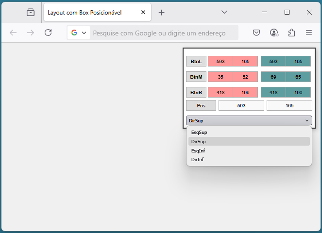
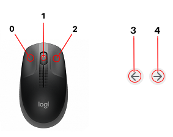

# EventosMouseJS

## Página simples em HTML5, CSS e Javascript 

Primeiro passo para entender eventos do mouse que conseguem ser capturados em Javascrip

   <br>


<br>
```
    
    ┌─────────────────────────────────────┐ 
    │ ┌──────┐ ┌─────┬─────┐┌─────┬─────┐ │ 
    │ │ BtnL │ │ XL1 │ YL1 ││ XL2 │ YL2 │ │ 
    │ └──────┘ └─────┴─────┘└─────┴─────┘ │ 
    ├─────────────────────────────────────┤ 
    │ ┌──────┐ ┌─────┬─────┐┌─────┬─────┐ │ 
    │ │ BtnM │ │ XM1 │ YM1 ││ XM2 │ YM2 │ │ 
    │ └──────┘ └─────┴─────┘└─────┴─────┘ │ 
    ├─────────────────────────────────────┤ 
    │ ┌──────┐ ┌─────┬─────┐┌─────┬─────┐ │ 
    │ │ BtnR │ │ XR1 │ YR1 ││ XR2 │ YR2 │ │ 
    │ └──────┘ └─────┴─────┘└─────┴─────┘ │ 
    ├─────────────────────────────────────┤ 
    │ ┌──────┐ ┌───────────┐┌───────────┐ │ 
    │ │ Pos  │ │     X     ││     Y     │ │ 
    │ └──────┘ └───────────┘└───────────┘ │ 
    ├─────────────────────────────────────┤ 
    │ ┌─────────────────────────────────┐ │ 
    │ │ DirSup                        ▼ │ │ 
    │ └─────────────────────────────────┘ │ 
    └─────────────────────────────────────┘
```
Ao movimentar o mouse verás os valores de X e Y do cursor.
Ao Clicar um botão e mante-lo pressionado irá guardar este valor e ao solta-lo mostrará o valor onde realizou a solta.
<table>
  <tr>
    <th rowspan="2">Nome</th>
    <th rowspan="2">VarArray</th>
    <th colspan="2">Posição quando clicado</th>
    <th colspan="2">Posição quando desclicado</th>
  </tr>
  <tr>
    <th>X</th> <th>Y</th>  <th>X</th><th>Y</th>
  </tr>
  <tr>
    <td>BtnL</td>  <td>0</td>  <td></td> <td></td>  <td></td> <td> </td>
  </tr>
  <tr>
    <td>BtnM</td>  <td>1</td>  <td></td> <td></td>  <td></td> <td> </td>
  </tr>
  <tr>
    <td>BtnR</td>  <td>2</td>  <td></td> <td></td>  <td></td> <td> </td>
  </tr>
</table>



Apenas 0, 1 e 2 no exemplo. Valor correspondente a VarArry da tabela

[Preview](https://htmlpreview.github.io/?https://github.com/JRGGRoberto/EventosMouseJS/blob/main/EventoMouse.html)


 


